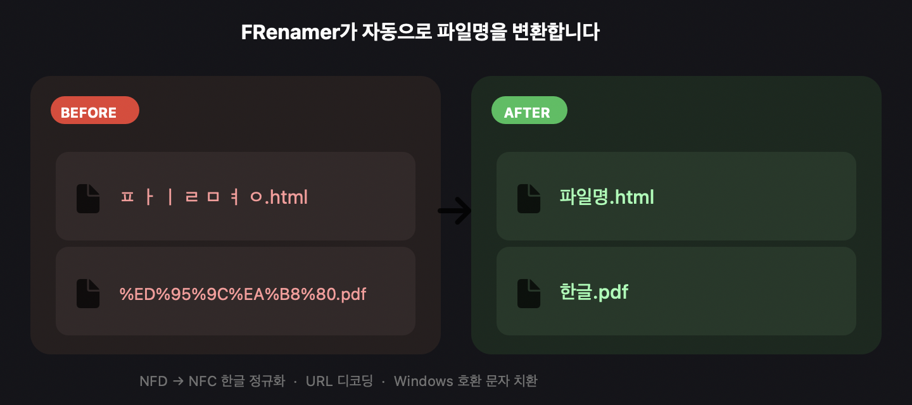
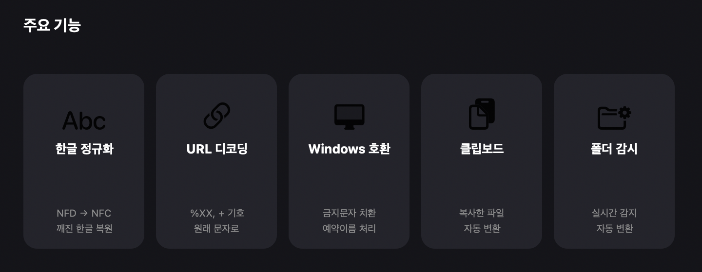
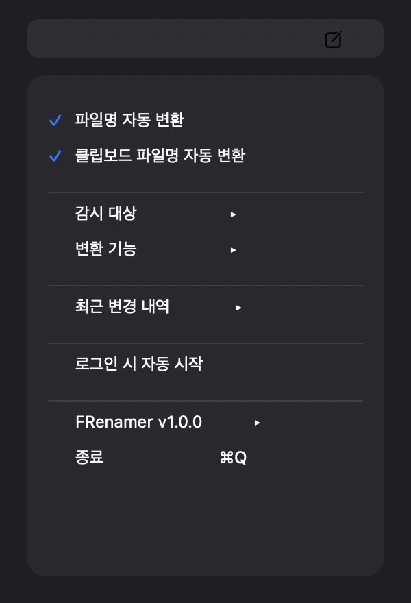

  

# FRenamer

**macOS 파일명 자동 변환 유틸리티**

다운로드한 파일의 깨진 한글, URL 인코딩, Windows 호환 문제를 자동으로 감지하고 변환합니다.
메뉴바에 상주하며 실시간으로 동작합니다.

---

## 이런 문제를 해결합니다

| 문제 | 원인 | 변환 결과 |
|------|------|-----------|
| `ㅍ ㅏ ㅣ ㄹ ㅁ ㅕ ㅇ.html` | 한글 NFD 분해 (Safari, AirDrop 등) | `파일명.html` |
| `%ED%95%9C%EA%B8%80.pdf` | URL 인코딩된 파일명 | `한글.pdf` |
| `보고서:최종\|v2.docx` | Windows 금지 문자 포함 | `보고서_최종_v2.docx` |
| `CON.txt`, `NUL.pdf` | Windows 예약 파일명 | `_CON.txt`, `_NUL.pdf` |
| `파일    이름.txt` | 연속 공백 | `파일 이름.txt` |

---

## 주요 기능

  

- **한글 정규화 (NFD → NFC)** — Safari, AirDrop 등에서 발생하는 한글 자모 분리 문제 자동 복원
- **URL 디코딩** — `%XX`, `+` 기호를 원래 문자로 변환
- **Windows 호환 문자 치환** — `\ / : * ? " < > |` 등 금지 문자를 안전한 문자로 교체
- **Windows 예약 파일명 처리** — `CON`, `PRN`, `NUL` 등 예약어 앞에 `_` 추가
- **공백 정리** — 연속된 공백을 하나로 통합
- **클립보드 파일명 자동 변환** — Cmd+C로 복사한 파일도 자동 감지
- **감시 폴더 실시간 모니터링** — 다운로드, 데스크톱 등 주요 폴더 자동 감시
- **개별 기능 ON/OFF** — 필요한 변환 기능만 선택적으로 사용

---

## 메뉴바 미리보기

  

---

## 설치

### DMG (권장)

1. [최신 릴리즈](https://github.com/mgang4u-dev/FRenamer-releases/releases/latest)에서 `.dmg` 파일 다운로드
2. DMG를 열고 `FRenamer.app`을 `/Applications`로 드래그
3. 처음 실행 시 `시스템 설정 > 개인 정보 보호 > 열기 허용` 필요

### 자동 업데이트

앱 내에서 **FRenamer v{버전} → 업데이트 확인**으로 최신 버전을 확인하고 자동 업데이트할 수 있습니다.

---

## 기본 감시 폴더

| 폴더 | 경로 |
|------|------|
| 다운로드 | `~/Downloads` |
| 데스크톱 | `~/Desktop` |
| 문서 | `~/Documents` |
| 사진 | `~/Pictures` |
| 음악 | `~/Music` |
| 동영상 | `~/Movies` |

감시 대상 메뉴에서 폴더별 ON/OFF 전환 및 사용자 폴더 추가/삭제가 가능합니다.

---

## 시스템 요구 사항

- macOS 12.0 (Monterey) 이상
- Apple Silicon (arm64)

---

## 라이선스

MIT License

---

  FRenamer는 메뉴바에 상주하며 파일이 생성되는 순간 자동으로 파일명을 변환합니다.

